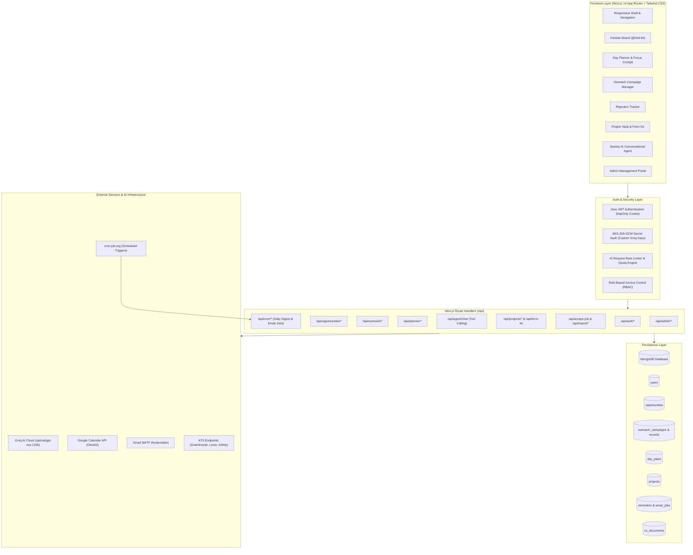

# HireCompass — Complete Technical Architecture & System Documentation

> **Version:** 1.0.0  
> **Target Audience:** Developers, Technical Architects, DevOps Engineers, and Product Owners  
> **Last Updated:** September 2026  

---

## Table of Contents
1. [Executive Summary & System Philosophy](#1-executive-summary--system-philosophy)
2. [System Architecture Diagram](#2-system-architecture-diagram)
3. [Technology Stack & Key Dependencies](#3-technology-stack--key-dependencies)
4. [Repository Topology & Directory Structure](#4-repository-topology--directory-structure)
5. [Database Architecture & MongoDB Schema Reference](#5-database-architecture--mongodb-schema-reference)
6. [Core Modules & Engineering Deep-Dive](#6-core-modules--engineering-deep-dive)
   - [6.1 Authentication, Session Management & Cryptography](#61-authentication-session-management--cryptography)
   - [6.2 AI Quota, LLM Gateway & Dynamic Encryption Vault](#62-ai-quota-llm-gateway--dynamic-encryption-vault)
   - [6.3 Opportunities Management & Kanban Pipeline](#63-opportunities-management--kanban-pipeline)
   - [6.4 Rejection Intelligence & Drop-off Tracker](#64-rejection-intelligence--drop-off-tracker)
   - [6.5 AI-Powered Cold Outreach Automation](#65-ai-powered-cold-outreach-automation)
   - [6.6 AI Day Planner & Execution Cockpit](#66-ai-day-planner--execution-cockpit)
   - [6.7 Project Vault & Form Kit](#67-project-vault--form-kit)
   - [6.8 ATS Job Scraper & Intelligent Importer](#68-ats-job-scraper--intelligent-importer)
   - [6.9 Autonomous AI Agent ("Sweety")](#69-autonomous-ai-agent-sweety)
   - [6.10 Interview Management & Google Calendar Sync](#610-interview-management--google-calendar-sync)
   - [6.11 Notification Subsystem, Email Alerts & Morning Digest](#611-notification-subsystem-email-alerts--morning-digest)
   - [6.12 Administration, Observability & User Management](#612-administration-observability--user-management)
7. [Comprehensive API Route Matrix](#7-comprehensive-api-route-matrix)
8. [Environment Configuration Reference](#8-environment-configuration-reference)
9. [DevOps, Local Development & Deployment Guide](#9-devops-local-development--deployment-guide)
10. [Companion Roadmap: DSA & Problem Tracker Integration](#10-companion-roadmap-dsa--problem-tracker-integration)

---

## 1. Executive Summary & System Philosophy

**HireCompass** is an intelligent, full-stack career orchestration and job application intelligence platform designed to eliminate the friction, disorganization, and manual fatigue of the modern tech hiring market. 

Job seeking in software engineering has evolved into a multi-variable problem requiring:
- Tracking dozens of active applications across different interview stages.
- Managing Online Assessments (OAs), technical rounds, take-homes, and HR screens.
- Performing structured post-mortems on rejections to identify skill gaps.
- Sending hyper-personalized cold outreach emails to recruiters without getting flagged.
- Aligning portfolio projects with job descriptions for fast form filling.
- Maintaining daily discipline with focused preparation, coding practice, and application quotas.

HireCompass unifies these disparate concerns into a cohesive workspace powered by **Next.js 14 App Router**, **MongoDB**, **Tailwind CSS**, and **Groq Cloud LLMs (`openai/gpt-oss-120b`)**.

---

## 2. System Architecture Diagram



---

## 3. Technology Stack & Key Dependencies

### 3.1 Frontend Framework & Runtime
- **Next.js 14.2.15**: App Router architecture utilizing Server Components where appropriate and Client Components (`"use client"`) for rich interactive dashboards. Turbopack enabled (`next dev --turbo`).
- **React 18.3.1**: Modern React concurrent features and hooks.
- **TypeScript 5.4.5**: Strict type safety across components, route handlers, and database contracts.

### 3.2 Styling & User Interface
- **Tailwind CSS 3.4.3** & **tailwindcss-animate**: Utility-first CSS styling augmented by CSS variable tokens.
- **next-themes 0.4.6**: Theme switching supporting dark and light modes with zero flash.
- **Lucide React 0.378.0**: Modern, cohesive iconography.
- **@dnd-kit/core, @dnd-kit/sortable, @dnd-kit/utilities**: Accessible, high-performance drag-and-drop mechanics powering the Kanban pipeline.
- **Recharts 3.10.1**: Responsive SVG charts powering the analytics and rejection distribution visualizers.

### 3.3 State Management & Data Fetching
- **@tanstack/react-query 5.37.1**: Declarative server-state caching, automatic cache invalidation, and optimistic UI mutations.
- **Zustand 4.5.2**: Lightweight client-side UI store (`hooks/useStore.ts`) managing sidebar states and viewport breakpoints.
- **nuqs 2.8.9**: Type-safe URL query state management for filter persistence.

### 3.4 Backend & Persistence
- **MongoDB Node.js Driver 6.6.2**: Native driver with connection pooling across hot-module-reloads via `lib/mongodb.ts`.
- **Jose 6.2.3**: Lightweight JavaScript Object Signing and Encryption for HS256 JWT tokens.
- **bcryptjs 3.0.3**: Salted password hashing for credentials authentication.
- **Node.js Crypto**: Built-in cryptographic module providing AES-256-GCM symmetric encryption for user-supplied API keys.

### 3.5 AI & Parsing Engines
- **Groq SDK 1.2.1**: Blazing fast inference interface querying `openai/gpt-oss-120b` (128k context window).
- **Cheerio 1.2.0**: Fast server-side DOM parser for extracting job content from unstructured HTML postings.
- **pdf-parse 2.4.5**: Binary buffer parser extracting text streams from uploaded PDF resumes and CVs.
- **papaparse 5.5.3** & **xlsx 0.18.5**: Multi-format parser for ingesting recruiter contacts from CSV and Excel files.

### 3.6 Communications & External APIs
- **Nodemailer 9.0.0**: SMTP mail transport protocol handler for transactional emails, reminders, and cold outreach.
- **googleapis 173.0.0**: Google OAuth2 client and Calendar v3 SDK for calendar synchronization.

---

## 4. Repository Topology & Directory Structure

```
HireCompass/
├── app/                                # Next.js App Router root
│   ├── (auth)/                         # Unauthenticated auth group
│   │   ├── login/page.tsx              # User login interface
│   │   └── signup/page.tsx             # User registration interface
│   ├── (dashboard)/                    # Authenticated dashboard application
│   │   ├── layout.tsx                  # Dashboard parent layout wrapping shell & providers
│   │   ├── admin/page.tsx              # System administration & user telemetry
│   │   ├── analytics/page.tsx          # Application funnel & conversion metrics
│   │   ├── applications/page.tsx       # Drag-and-drop Kanban pipeline
│   │   ├── assistant/page.tsx          # Redirects to /planner
│   │   ├── dashboard/page.tsx          # Master command center & ghosting radar
│   │   ├── import/page.tsx             # Smart ATS URL & pasted JD scraper
│   │   ├── interviews/page.tsx         # Interview schedule & Google Meet links
│   │   ├── opportunities/page.tsx      # Comprehensive searchable job catalog
│   │   ├── outreach/                   # Cold outreach campaign hub
│   │   │   ├── page.tsx                # Campaign list & aggregate statistics
│   │   │   ├── upload/page.tsx         # CSV / Excel recruiter contact parser
│   │   │   └── campaign/[id]/          # Campaign review, generation & dispatch
│   │   │       ├── page.tsx            # Recruiter record editor & batch sender
│   │   │       └── analytics/page.tsx  # Campaign-specific delivery & reply stats
│   │   ├── planner/page.tsx            # AI Day Planner & Execution Cockpit
│   │   ├── projects/page.tsx           # Portfolio project repository & snippet tailor
│   │   ├── rejected/page.tsx           # Rejection intelligence & fumble diagnostics
│   │   ├── reminders/page.tsx          # Deadlines, follow-up calendar & email alerts
│   │   ├── resumes/page.tsx            # Document vault & resume version manager
│   │   └── settings/page.tsx           # Profile, encryption vault & digest preferences
│   ├── api/                            # Backend route handlers (REST endpoints)
│   │   ├── admin/                      # Admin routes (stats, users, resumes)
│   │   ├── agent/chat/                 # Autonomous AI Agent ("Sweety") tool-calling route
│   │   ├── ai/                         # Modular AI inference routes (match, snippets, plan)
│   │   ├── analytics/                  # Funnel calculations & ghosted app detectors
│   │   ├── auth/                       # Signup, login, logout, me, profile, password
│   │   ├── cron/                       # Scheduled endpoints (daily-digest, process-emails)
│   │   ├── dashboard/                  # Aggregate stats & activity streams
│   │   ├── documents/                  # CV upload, retrieval, deletion & parsing
│   │   ├── form-kit/                   # Project-to-opportunity skill overlap ranker
│   │   ├── google-calendar/            # OAuth2 auth, callback, event sync
│   │   ├── import/                     # Text, URL, and JD parsers
│   │   ├── interviews/                 # CRUD for scheduled interviews
│   │   ├── opportunities/              # CRUD for job applications & status mutations
│   │   ├── outreach/                   # Campaigns, records, extraction, email generation
│   │   ├── planner/                    # Plan generation, reshuffle, task assist, today's plan
│   │   ├── projects/                   # Portfolio projects & AI snippet generator
│   │   ├── reminders/                  # CRUD for alert reminders
│   │   ├── scrape-job/                 # Direct ATS / Cheerio web scraper
│   │   └── settings/                   # User Groq key validation & digest config
│   ├── globals.css                     # Global Tailwind imports & CSS variable themes
│   ├── layout.tsx                      # Root HTML shell with fonts and metadata
│   ├── page.tsx                        # Root redirect route
│   └── providers.tsx                   # React Query & NextThemes wrapper
├── components/
│   ├── features/                       # Domain-specific feature components
│   │   ├── agent/                      # Floating Sweety AI chat window
│   │   ├── assistant/                  # Match score gauge & fit visualizers
│   │   ├── dashboard/                  # GhostingRadar & SmartSuggestions widgets
│   │   ├── kanban/                     # AddJobModal, JobDrawer, KanbanBoard, KanbanCard
│   │   ├── opportunities/              # FilterSidebar & SearchBar with highlights
│   │   └── planner/                    # Cockpit, Intake, StrategyCards, Timer, Audio
│   ├── layout/                         # Core layout wrappers
│   │   ├── dashboard-shell.tsx         # Responsive container with sidebar toggle
│   │   ├── navbar.tsx                  # Top navigation, status indicator, user menu
│   │   └── sidebar.tsx                 # Navigation drawer with mobile backdrop
│   └── ui/                             # Generic reusable atoms
│       ├── badge.tsx                   # Company avatar, status, and priority badges
│       ├── install-prompt.tsx          # PWA installation banner
│       ├── notification-initializer.tsx# Browser notification permission requester
│       ├── rate-limit-banner.tsx       # Groq quota warning banner
│       └── toast.tsx                   # Custom toast notifications provider
├── hooks/
│   ├── useStore.ts                     # Zustand store for sidebar and global layout
│   └── useUser.ts                      # React Query hook for authenticated user state
├── lib/
│   ├── ai-quota.ts                     # AI request limiter, model resolver & BYOK logic
│   ├── auth.ts                         # Password hashing helper functions
│   ├── crypto.ts                       # AES-256-GCM encryption & decryption for API keys
│   ├── email.ts                        # Nodemailer HTML template builders & dispatchers
│   ├── gemini.ts                       # Groq SDK adapter (extractJSON, streamText)
│   ├── google-calendar.ts              # Google Calendar OAuth2 client & event creator
│   ├── job-scraper.ts                  # ATS detection, JSON-LD parser, and Cheerio scraper
│   ├── mongodb.ts                      # Cached MongoDB client connection singleton
│   ├── session.ts                      # Jose JWT cookie creation, verification & RBAC guards
│   └── utils.ts                        # Class name merger (`cn`)
├── types/
│   ├── opportunity.ts                  # Types for jobs, OAs, interviews, offers, rejections
│   ├── outreach.ts                     # Types for campaigns, recruiter rows, email states
│   ├── planner.ts                      # Types for day plans, strategies, tasks, energy levels
│   ├── project.ts                      # Types for portfolio projects, snippets, FormKit items
│   └── user.ts                         # User document, session user, and encryption types
├── public/                             # Static public assets (avatars, icons, logos)
├── styles/                             # Modular styling sheets
│   ├── animations.css                  # Custom keyframe animations
│   ├── components.css                  # Reusable card, button, and glassmorphism styles
│   └── variables.css                   # Custom theme tokens and colors
├── .env.example                        # Documented environment variable template
├── package.json                        # NPM package manifests & scripts
├── tailwind.config.js                  # Tailwind configuration with customized palette
└── tsconfig.json                       # TypeScript compiler paths and settings
```

---

## 5. Database Architecture & MongoDB Schema Reference

The persistence tier runs on MongoDB. Below is the comprehensive schema definition for every collection.

### 5.1 `users` Collection
Stores user identity, hashed credentials, role classification, and AI quota/BYOK settings.

```typescript
{
  _id: ObjectId,
  name: string,
  email: string,                       // Unique index
  passwordHash: string,                // bcrypt hash
  role: "admin" | "user",              // Role-based access control
  aiAccess: "DEFAULT" | "UNRESTRICTED" | "DISABLED",
  aiLimit?: number,                    // Overrides system default free quota
  aiUsage: {
    count: number,                     // Number of AI requests used
    limit?: number,
    lastUsedAt?: Date
  },
  groqKey?: {                          // User's own encrypted API key (BYOK)
    ciphertext: string,                // Hex-encoded AES-256-GCM ciphertext
    iv: string,                        // Hex-encoded 96-bit initialization vector
    tag: string                        // Hex-encoded authentication tag
  },
  groqModel?: string,                  // User-selected Groq model
  createdAt: Date,
  updatedAt: Date
}
```

### 5.2 `opportunities` Collection
Represents individual job applications through their complete lifecycle.

```typescript
{
  _id: ObjectId,
  userId: string,                      // Foreign key -> users._id
  title: string,                       // e.g. "Software Engineer - Backend"
  company: string,                     // e.g. "Stripe"
  location?: string,                   // e.g. "San Francisco, CA"
  isRemote?: boolean,
  employmentType?: "INTERNSHIP" | "FULL_TIME" | "CONTRACT" | "PART_TIME",
  salary?: string,                     // e.g. "$140,000 - $170,000"
  url?: string,                        // Job posting URL
  sourcePlatform?: "LINKEDIN" | "INTERNSHALA" | "GLASSDOOR" | "ANGELLIST" | "COMPANY_SITE" | "REFERRAL" | "OTHER",
  status: "SAVED" | "INTERESTED" | "APPLIED" | "ASSESSMENT" | "INTERVIEW" | "OFFER" | "REJECTED",
  priority: "HIGH" | "MEDIUM" | "LOW",
  deadline?: Date | string,
  skills?: string[],                   // e.g. ["TypeScript", "Node.js", "PostgreSQL"]
  tags?: string[],                     // e.g. ["fintech", "series-b"]
  notes?: string,
  timeline: Array<{
    id?: string,
    event: string,                     // e.g. "Status changed to APPLIED"
    description?: string,
    timestamp: Date
  }>,
  
  // Online Assessment (OA) details
  oaDetails?: {
    totalRounds?: number,
    currentRound?: number,
    platform?: string,                 // HackerRank, CodeSignal, LeetCode, etc.
    date?: Date | string,
    topics?: string[],
    status?: "PENDING" | "CLEARED" | "FAILED",
    score?: string,
    notes?: string
  },

  // Structured Technical Interview Rounds
  interviewRounds?: Array<{
    id: string,
    roundNumber: number,
    roundName: string,
    roundType: "OA" | "TECHNICAL" | "SYSTEM_DESIGN" | "BEHAVIORAL" | "HR" | "MANAGERIAL" | "TAKE_HOME" | "OTHER",
    date?: Date | string,
    interviewer?: string,
    topicsCovered?: string,
    difficulty?: "EASY" | "MEDIUM" | "HARD",
    status: "PASSED" | "FAILED" | "PENDING" | "SCHEDULED",
    notes?: string
  }>,

  // HR / Recruiter screen details
  isHrRound?: boolean,
  hrRoundDetails?: {
    isCompleted?: boolean,
    recruiterName?: string,
    date?: Date | string,
    expectedSalary?: string,
    currentSalary?: string,
    noticePeriod?: string,
    cultureFitNotes?: string,
    status?: "PENDING" | "CLEARED" | "FAILED"
  },

  // Offer details
  offerDetails?: {
    totalAmount?: string,
    baseSalary?: string,
    bonus?: string,
    stocks?: string,
    deadline?: Date | string,
    location?: string,
    notes?: string
  },

  // Rejection post-mortem diagnostics
  rejectionDetails?: {
    stage: string,                     // Drop-off stage
    reasonCategory?: string,           // e.g. "DSA & Problem-Solving Speed Gaps"
    whatWasAsked?: string,             // Specific interview question
    whyRejected?: string,              // Company feedback
    whereFumbled?: string,             // Candidate's self-reflection
    lessonsLearned?: string,           // Action item for future interviews
    rejectionDate?: Date | string
  },

  createdAt: Date,
  updatedAt: Date
}
```

### 5.3 `projects` Collection
Contains user portfolio projects and modular AI-generated snippets for rapid application completion.

```typescript
{
  _id: ObjectId,
  userId: string,
  name: string,
  description: string,                 // Master elevator pitch
  documentationText?: string,          // Detailed architectural markdown
  techStack: string[],                 // ["Next.js", "MongoDB", "Tailwind"]
  roleCategories: string[],            // ["fullstack", "backend", "cloud"]
  metrics: string[],                   // ["Reduced latency by 45%", "Handled 10k DAU"]
  links: {
    github?: string,
    live?: string
  },
  snippets: Array<{
    id: string,
    roleTag: string,                   // e.g. "Backend SDE Intern"
    length: "short" | "medium" | "long" | "custom",
    customWords?: number,
    companyName?: string,
    jobDescription?: string,
    content: string,                   // Generated tailored snippet
    isAiGenerated: boolean,
    createdAt: Date
  }>,
  createdAt: Date,
  updatedAt: Date
}
```

### 5.4 `cv_documents` Collection
Stores uploaded resumes, cover letters, and parsed plain text for AI context.

```typescript
{
  _id: ObjectId,
  userId: string,
  name: string,                        // File name
  type: "RESUME" | "COVER_LETTER" | "PORTFOLIO" | "TRANSCRIPT" | "OTHER",
  targetRole?: string,                 // e.g. "Fullstack Developer"
  fileData: BinaryBuffer | string,     // Stored resume binary or base64
  mimeType: string,                    // "application/pdf"
  sizeBytes: number,
  parsedContent?: string,              // Text extracted via pdf-parse
  uploadedAt: Date
}
```

### 5.5 `outreach_campaigns` & `outreach_records` Collections
Drives the AI cold emailing automation module.

**`outreach_campaigns`:**
```typescript
{
  _id: ObjectId,
  userId: string,
  name: string,                        // e.g. "YCombinator Summer 2026 Batch"
  status: "DRAFT" | "GENERATING" | "READY" | "SENDING" | "SENT" | "ARCHIVED",
  totalRecords: number,
  sentCount: number,
  repliedCount: number,
  interviewCount: number,
  attachedCvId?: string,               // Foreign key -> cv_documents._id
  dailyLimit: number,                  // Default 20 emails/day
  delaySeconds: number,                // Default 30s delay between emails
  createdAt: Date,
  updatedAt: Date
}
```

**`outreach_records`:**
```typescript
{
  _id: ObjectId,
  campaignId: string,                  // Foreign key -> outreach_campaigns._id
  userId: string,
  recruiterName: string,
  recruiterEmail: string,
  recruiterRole: string,
  companyName: string,
  companyDescription: string,
  industry: string,
  techStack: string[],
  hiringRequirements: string,
  additionalNotes: string,
  
  // AI Enrichment Output
  companyContext?: {
    companyName: string,
    summary: string,
    industry: string,
    products: string[],
    technologies: string[],
    talkingPoints: string[],
    relevantSkills: string[]
  },
  
  generatedEmail?: string,             // AI synthesized proposal
  emailSubject?: string,
  finalEmail?: string,                 // User edited version
  status: "PENDING" | "DRAFT" | "APPROVED" | "SKIPPED" | "SENDING" | "SENT" | "REPLIED" | "INTERVIEW" | "OFFER" | "REJECTED" | "FOLLOW_UP_SENT",
  sentAt?: Date,
  error?: string,
  followUpSentAt?: Date
}
```

### 5.6 `day_plans` Collection
Stores the daily timeboxed execution plan and Pomodoro/focus session statistics.

```typescript
{
  _id: ObjectId,
  userId: string,
  date: string,                        // YYYY-MM-DD
  rawInput: string,                    // Raw natural language goals
  availableHours: number,              // e.g. 6.5
  energyLevel: "morning_peak" | "afternoon_peak" | "night_owl" | "balanced",
  intensity: "light" | "balanced" | "crunch",
  selectedStrategyId: string,
  strategyName: string,                // "Deep Work Sprint", etc.
  strategyTagline?: string,
  tasks: Array<{
    id: string,
    title: string,
    category: "study" | "interview_prep" | "application" | "coding" | "break" | "review",
    durationMinutes: number,
    startTime?: string,                // "09:00 AM"
    endTime?: string,                  // "10:30 AM"
    priority: "high" | "medium" | "low",
    completed: boolean,
    completedAt?: string,
    description?: string,
    notes?: string,
    aiTips?: string[]
  }>,
  status: "active" | "completed" | "abandoned",
  focusMinutesLogged: number,
  createdAt: Date,
  updatedAt: Date
}
```

### 5.7 `interviews`, `reminders` & `email_jobs` Collections
Manages calendar events, tasks, and queued asynchronous emails.

**`interviews`:**
```typescript
{
  _id: ObjectId,
  userId: string,
  company: string,
  role: string,
  date: string,                        // YYYY-MM-DD
  time: string,                        // HH:MM
  type: string,                        // "Technical Phone Screen", "System Design", etc.
  location?: string,
  link?: string,                       // Zoom / Google Meet link
  notes?: string,
  status: "UPCOMING" | "COMPLETED" | "CANCELLED",
  opportunityId?: string,
  createdAt: Date
}
```

**`reminders`:**
```typescript
{
  _id: ObjectId,
  userId: string,
  jobId?: string,
  jobTitle?: string,
  company?: string,
  type: "DEADLINE" | "FOLLOWUP" | "INTERVIEW" | "EVENT" | "REGISTRATION" | "TASK" | "CUSTOM",
  dueAt: Date,
  eventDate?: Date,
  registrationDeadline?: Date,
  message: string,
  done: boolean,
  googleCalendarEventId?: string,      // Tracked if synced with Google Calendar
  createdAt: Date
}
```

**`email_jobs`:**
```typescript
{
  _id: ObjectId,
  reminderId: string,
  userId: string,
  userEmail: string,
  sendAt: Date,
  status: "pending" | "sent" | "failed" | "cancelled",
  processedAt?: Date,
  error?: string
}
```

---

## 6. Core Modules & Engineering Deep-Dive

### 6.1 Authentication, Session Management & Cryptography
HireCompass features a custom JWT implementation (`lib/session.ts`) built with `jose` that supersedes heavy session libraries.
- **Session Tokens**: Tokens are signed using **HS256** with `JWT_SECRET` (validated to be at least 32 characters long).
- **Cookie Security**: Tokens are placed inside an `httpOnly`, `SameSite=Lax`, `Secure` (in production) cookie named `auth-token` with a 30-day lifespan. Javascript execution cannot inspect this cookie, mitigating XSS token harvesting.
- **Payload Minimization**: Contains only minimal claims: `{ sub: userId, name, email, role }`.
- **Role-Based Guards**: Functions `getSession(request)` and `requireAdmin(request)` provide instant authorization checks across route handlers.

### 6.2 AI Quota, LLM Gateway & Dynamic Encryption Vault
The AI subsystem (`lib/gemini.ts`, `lib/ai-quota.ts`, `lib/crypto.ts`) abstracts model inference across all features.
- **Inference Engine**: Connects via `groq-sdk` to `openai/gpt-oss-120b`, delivering high-speed reasoning with low latency.
- **Two Operating Modes**:
  1. *Structured JSON Output*: `extractJSON<T>(prompt)` instructs the LLM to return strict JSON using `response_format: { type: "json_object" }`. It automatically retries on rate limits (HTTP 429/503) with exponential backoff and message parsing (`parseRetryDelay`).
  2. *Streaming Text*: `streamText(prompt)` returns a standard Web `ReadableStream<Uint8Array>` for chunked live-typing in the browser.
- **Hybrid AI Quota Engine**:
  - Unauthenticated users have no access.
  - Standard users receive a free allowance (default: 30 requests, configurable via `FREE_AI_LIMIT`).
  - Administrators and users with `aiAccess: "UNRESTRICTED"` enjoy unlimited platform requests.
  - Standard users can unlock **Bring-Your-Own-Key (BYOK)** by inputting their personal Groq API key (`gsk_...`).
- **AES-256-GCM Secret Vault**: User API keys are never stored in plaintext. In `lib/crypto.ts`, keys are encrypted with an initialization vector (`iv`), ciphertext, and authentication tag (`tag`) derived from `ENCRYPTION_SECRET`. Only when the user triggers an AI action is the key temporarily decrypted in memory.

### 6.3 Opportunities Management & Kanban Pipeline
Located in `app/(dashboard)/applications/page.tsx` and `components/features/kanban/`:
- Built with `@dnd-kit/core` and `@dnd-kit/sortable` for silky drag-and-drop state changes across 6 distinct Kanban columns: `Saved`, `Applied`, `OA / Assessment`, `Interview`, `Offer 🎉`, and `Rejected ❌`.
- Supports comprehensive filtering by keyword, priority, platform source, remote-only flags, and employment type.
- Features the **JobDrawer** (`components/features/kanban/job-drawer.tsx`), a sliding modal that enables logging structured interview rounds, OA questions, compensation offers, and custom timelines.

### 6.4 Rejection Intelligence & Drop-off Tracker
Located in `app/(dashboard)/rejected/page.tsx`:
- Most job search tools treat rejection as a dead end. HireCompass transforms it into a diagnostic learning engine.
- Filters applications in the `REJECTED` status and computes a **Funnel Drop-off Analysis** across standardized stages:
  1. Resume Screen / No Shortlist
  2. Online Assessment (OA)
  3. Technical Round 1 (DSA / Problem Solving)
  4. Technical Round 2 (System Architecture / Core Engineering)
  5. Hiring Manager / Behavioral
  6. Post-Interview Headcount Freeze
- Categorizes failure reasons into 11 distinct buckets and prompts the candidate for deep reflection (*What was asked?*, *Where did you fumble?*, *Lessons learned*).
- Provides instant recommendations and prompts the candidate to generate a customized AI learning plan.

### 6.5 AI-Powered Cold Outreach Automation
Located in `app/(dashboard)/outreach/`:
- **Recruiter Ingestion**: Upload recruiter CSV or Excel sheets via `upload/page.tsx`. `papaparse` and `xlsx` normalize disparate header conventions (e.g. "Email", "E-mail", "Recruiter Email") and filter duplicate or invalid addresses.
- **AI Context Enrichment**: `app/api/outreach/extract/route.ts` analyzes company descriptions and tech stacks to synthesize key talking points and skill matches.
- **Hyper-Personalized Email Synthesis**: `app/api/outreach/generate-emails/route.ts` combines recruiter data, company pain points, and the candidate's uploaded CV to compose targeted cold outreach emails.
- **Throttled Dispatch via Nodemailer**: `app/api/outreach/send/route.ts` sends emails directly through the user's configured Gmail SMTP with customizable inter-message delays (default 30 seconds) and daily caps to prevent domain reputation burns.
- **Automatic Opportunity & Follow-up Creation**: Dispatching an outreach email automatically logs a new `APPLIED` entry on the Kanban board and schedules a follow-up reminder 4 days later.

### 6.6 AI Day Planner & Execution Cockpit
Located in `app/(dashboard)/planner/page.tsx` and `components/features/planner/`:
- Eliminates "analysis paralysis" for candidates juggling coding practice, applications, and interview preparation.
- **Intake Flow**: Accepts natural language descriptions of the day's goals, available hours (1 to 14 hrs), energy rhythm (*Morning Peak*, *Afternoon Peak*, *Night Owl*, *Balanced*), and intensity level (*Light*, *Balanced*, *Crunch*).
- **Strategy Synthesis**: Ingests existing interviews and upcoming deadlines to propose 3 distinct scheduling vibes:
  1. *Deep Work Sprint*: Focus blocks dedicated to heavy problem solving and system design.
  2. *Balanced Flow*: Interleaved study, application bursts, and mental recharge breaks.
  3. *Momentum Velocity*: Rapid, low-friction task completion for high-output velocity.
- **Execution Cockpit**: Features an interactive focus timer, Pomodoro counters, task completion checklists, and synthesized audio bell frequencies (`audio-generator.ts`) via the Web Audio API.
- **Mid-Day Reshuffle Engine**: If a candidate runs 30 or 60 minutes late, or experiences unexpected fatigue, the reshuffle modal prompts the AI to reorganize the remaining hours without losing momentum.

### 6.7 Project Vault & Form Kit
Located in `app/(dashboard)/projects/page.tsx` and `app/api/form-kit/route.ts`:
- Maintains master documentation for portfolio repositories, key metrics, and architecture summaries.
- **Snippet Tailor**: Automatically crafts project descriptions tuned for specific role tags (e.g. "Backend SDE Intern" vs. "Fullstack Engineer") across four standard lengths:
  - Short (~50 words)
  - Medium (~150 words)
  - Long (~300 words)
  - Custom word targets
- **Form Kit Scoring Engine**: When applying to a job, Form Kit computes a Jaccard & substring skill overlap score (0–100%) between the opportunity's required skills and the candidate's projects, presenting ready-to-copy snippets to accelerate job portal forms.

### 6.8 ATS Job Scraper & Intelligent Importer
Located in `app/(dashboard)/import/page.tsx` and `lib/job-scraper.ts`:
- Automatically identifies ATS job board URLs:
  - **Greenhouse API**: Fetches structured JSON directly from `boards.greenhouse.io/api/v1/boards/{company}/jobs/{id}`.
  - **Lever API**: Queries `api.lever.co/v0/postings/{company}/{id}`.
  - **Ashby HQ**: Direct JSON queries against `jobs.ashbyhq.com`.
  - **Generic Career Portals**: Parses JSON-LD `<script type="application/ld+json">` metadata schemas with Cheerio.
  - **Unstructured / Raw Text Fallback**: Employs Groq AI to extract structured job titles, locations, compensation ranges, required technologies, and deadlines from raw text blobs.

### 6.9 Autonomous AI Agent ("Sweety")
Located in `components/features/agent/agent-chat.tsx` and `app/api/agent/chat/route.ts`:
- "Sweety" is a full-featured conversational copilot embedded in the dashboard shell.
- Powered by LLM **Tool Calling** (Function Calling) with 15+ executable platform tools:
  - `list_opportunities`, `add_opportunity`, `update_opportunity_status`, `delete_opportunity`
  - `create_reminder`, `list_reminders`, `mark_reminder_done`
  - `create_interview`, `list_interviews`
  - `get_analytics`, `get_ghosted_applications`, `draft_followup_email`
  - `list_projects`, `generate_project_snippet`
  - `list_campaign_hrs`, `preview_hr_email`, `send_hr_email`
  - `scrape_job_url`, `save_groq_api_key`
- Supports two-turn interaction loops: parses user intent, executes database or SMTP side-effects, and returns confirmed state changes to the UI.

### 6.10 Interview Management & Google Calendar Sync
Located in `app/(dashboard)/interviews/page.tsx` and `lib/google-calendar.ts`:
- Tracks upcoming interviews, meeting coordinates, video links (Zoom, Google Meet), and preparation notes.
- **Two-Way Google Calendar Sync**:
  - Implements OAuth2 authorization code flow via `app/api/google-calendar/auth` and `/callback`.
  - Authenticates via Google APIs client and inserts events with customized reminder notification thresholds (24h email, 5m popup).

### 6.11 Notification Subsystem, Email Alerts & Morning Digest
Located in `lib/email.ts` and `app/api/cron/`:
- **Transactional Alert Emails**: Dispatches beautifully styled HTML emails for impending application deadlines, interview reminders, and registration gates.
- **Asynchronous Email Queue**: Background alerts are recorded in `email_jobs` and dispatched in batches by `/api/cron/process-emails` to avoid blocking user interactions.
- **Daily Morning Digest**: `/api/cron/daily-digest` triggers every morning (typically via cron-job.org at 08:00 IST), assembling:
  - Today's pending reminders and deadlines
  - Interviews scheduled within the next 72 hours
  - Applications at risk of ghosting (>14 days without movement)
  - Current Kanban pipeline tally (Applied, Interview, Offer, Rejected)

### 6.12 Administration, Observability & User Management
Located in `app/(dashboard)/admin/page.tsx` and `app/api/admin/`:
- Dedicated portal restricted to users with `role: "admin"`.
- **System Telemetry**: Displays total platform user registrations, cumulative job opportunities tracked, total uploaded resumes, and global AI inference request volumes.
- **User Governance**: Inspect user access modes (`DEFAULT`, `UNRESTRICTED`, `DISABLED`), modify custom AI quota caps, inspect encrypted key presence, or ban compromised accounts.
- **Resume Vault Inspection**: Inspect and verify uploaded user documents and storage allocations.

---

## 7. Comprehensive API Route Matrix

| HTTP Method | Route Endpoint | Auth Required | Description |
| :--- | :--- | :--- | :--- |
| **POST** | `/api/auth/signup` | No | Creates a new user with bcrypt password hashing and default AI quota |
| **POST** | `/api/auth/login` | No | Authenticates credentials and sets `auth-token` HTTP-only cookie |
| **POST** | `/api/auth/logout` | No | Clears the `auth-token` session cookie |
| **GET** | `/api/auth/me` | Yes | Returns current authenticated user profile and AI usage data |
| **PUT** | `/api/auth/profile` | Yes | Updates name, email, or profile metadata |
| **PUT** | `/api/auth/password` | Yes | Verifies current password and updates to new password |
| **GET** | `/api/opportunities` | Yes | Returns all user opportunities with optional status/search filters |
| **POST** | `/api/opportunities` | Yes | Creates a new tracked opportunity |
| **GET** | `/api/opportunities/[id]` | Yes | Fetches single opportunity details including OA and rounds |
| **PUT** | `/api/opportunities/[id]` | Yes | Updates opportunity fields, lifecycle status, or round data |
| **DELETE** | `/api/opportunities/[id]` | Yes | Deletes an opportunity and associated reminders |
| **GET** | `/api/dashboard/stats` | Yes | Calculates pipeline counts, response rate, and scheduled interviews |
| **GET** | `/api/dashboard/activity` | Yes | Returns recent user activities and timeline events |
| **GET** | `/api/analytics` | Yes | Computes recruitment funnel, conversion yields, and weekly velocity |
| **GET** | `/api/analytics/ghosted` | Yes | Identifies applications stuck in Applied/OA for >14 days |
| **POST** | `/api/agent/chat` | Yes | Multi-tool autonomous agent chat loop with function calling |
| **POST** | `/api/ai/match-score` | Yes | Evaluates candidate fit against a job description (0–100%) |
| **POST** | `/api/ai/learning-plan` | Yes | Streams structured markdown learning plan for missing skills |
| **POST** | `/api/ai/generate-snippet` | Yes | Synthesizes tailored project description based on role tag and length |
| **POST** | `/api/ai/generate-email` | Yes | Generates personalized outreach email for a specific company |
| **POST** | `/api/scrape-job` | Yes | Scrapes and extracts structured metadata from any job posting URL |
| **POST** | `/api/import/url` | Yes | Ingests job details from a link into the user's board |
| **POST** | `/api/import/text` | Yes | AI extraction of job details from raw pasted text |
| **POST** | `/api/import/jd` | Yes | Parses full JD and saves to opportunities collection |
| **GET** | `/api/outreach/campaigns` | Yes | Lists all cold outreach campaigns with sent/reply statistics |
| **POST** | `/api/outreach/campaigns` | Yes | Creates a new outreach campaign |
| **GET** | `/api/outreach/campaigns/[id]` | Yes | Returns campaign details and associated recruiter records |
| **DELETE** | `/api/outreach/campaigns/[id]` | Yes | Removes a campaign and its records |
| **POST** | `/api/outreach/extract` | Yes | Parses uploaded recruiter CSV/Excel and extracts contacts |
| **POST** | `/api/outreach/generate-emails`| Yes | Batch synthesizes cold emails for campaign recruiters |
| **POST** | `/api/outreach/send` | Yes | Dispatches queued outreach emails via Gmail SMTP |
| **POST** | `/api/outreach/followup` | Yes | Drafts and sends follow-up outreach email sequence |
| **PUT** | `/api/outreach/records/[id]` | Yes | Updates individual recruiter email content or status |
| **GET** | `/api/outreach/stats` | Yes | Returns aggregate outreach analytics and response rates |
| **GET** | `/api/planner/today` | Yes | Fetches active day plan and user focus statistics |
| **POST** | `/api/planner/generate` | Yes | Generates 3 scheduling strategy options from natural language input |
| **POST** | `/api/planner/reshuffle` | Yes | Reorganizes day plan tasks based on delays or fatigue |
| **POST** | `/api/planner/assist` | Yes | Generates actionable AI tips and guidance for an individual task |
| **GET** | `/api/planner/sync-context` | Yes | Extracts pending interviews and deadlines to merge into day plans |
| **GET** | `/api/projects` | Yes | Lists portfolio projects and their associated snippets |
| **POST** | `/api/projects` | Yes | Creates a portfolio project entry |
| **GET** | `/api/projects/[id]` | Yes | Fetches single project documentation |
| **PUT** | `/api/projects/[id]` | Yes | Updates project description, tech stack, and links |
| **DELETE** | `/api/projects/[id]` | Yes | Deletes a project record |
| **POST** | `/api/projects/[id]/snippets`| Yes | Saves an AI-generated snippet to a project |
| **GET** | `/api/form-kit` | Yes | Ranks projects by skill overlap for an opportunity |
| **GET** | `/api/interviews` | Yes | Lists upcoming and past interviews |
| **POST** | `/api/interviews` | Yes | Schedules an interview and syncs to Google Calendar |
| **PUT** | `/api/interviews/[id]` | Yes | Updates interview time, link, or status |
| **DELETE** | `/api/interviews/[id]` | Yes | Deletes an interview |
| **GET** | `/api/reminders` | Yes | Lists pending and completed reminders |
| **POST** | `/api/reminders` | Yes | Creates a reminder and queues an email alert |
| **PUT** | `/api/reminders/[id]` | Yes | Marks reminder as done or updates due date |
| **DELETE** | `/api/reminders/[id]` | Yes | Deletes a reminder |
| **GET** | `/api/documents` | Yes | Lists uploaded CV documents and parsed text |
| **POST** | `/api/documents` | Yes | Uploads PDF resume and parses text with pdf-parse |
| **DELETE** | `/api/documents/[id]` | Yes | Deletes a stored CV document |
| **GET** | `/api/google-calendar/auth` | Yes | Returns Google OAuth2 authorization URL |
| **GET** | `/api/google-calendar/callback`| No | OAuth2 code exchange callback |
| **POST** | `/api/google-calendar/sync` | Yes | Synchronizes pending interviews to user's Google Calendar |
| **POST** | `/api/settings/ai-key` | Yes | Validates, encrypts (AES-256-GCM), and saves user Groq API key |
| **PUT** | `/api/settings/digest` | Yes | Toggles daily digest email opt-in/opt-out |
| **GET** | `/api/cron/process-emails` | Secret | Processes queued email alerts for reminders |
| **GET** | `/api/cron/daily-digest` | Secret | Generates and sends morning digest emails to all active users |
| **GET** | `/api/admin/stats` | Admin | Returns system-wide user, opportunity, and AI usage metrics |
| **GET** | `/api/admin/users` | Admin | Lists all platform users with AI quota and status |
| **PUT** | `/api/admin/users/[id]` | Admin | Modifies user role, AI limit, or access mode |
| **DELETE** | `/api/admin/users/[id]` | Admin | Deletes a user account and associated data |
| **GET** | `/api/admin/resumes` | Admin | Global list of uploaded resumes |
| **DELETE** | `/api/admin/resumes/[id]` | Admin | Deletes a resume document from storage |

---

## 8. Environment Configuration Reference

Create a `.env` file in the root workspace based on `.env.example`:

```bash
# ── MongoDB Connection URI ───────────────────────────────────────────────────
# Connection string pointing to your local MongoDB instance or MongoDB Atlas cluster.
MONGODB_URI="mongodb://localhost:27017/hirecompass"

# ── JWT Authentication Secret ────────────────────────────────────────────────
# Cryptographically secure random secret (minimum 32 characters) used to sign HS256 tokens.
JWT_SECRET="generate-a-super-secret-jwt-key-at-least-32-characters-long"

# ── Secret Encryption Key (Optional / Recommended) ───────────────────────────
# Used by lib/crypto.ts to encrypt user-provided Groq API keys with AES-256-GCM.
# If omitted, system falls back to hashing JWT_SECRET.
ENCRYPTION_SECRET="generate-a-separate-32-byte-hex-encryption-secret-string"

# ── Gmail SMTP Configuration (Nodemailer) ────────────────────────────────────
# Required for sending cold outreach emails, reminder alerts, and morning digests.
# Note: Use an App Password (Google Account > Security > 2-Step Verification > App Passwords).
GMAIL_USER="your-email@gmail.com"
GMAIL_APP_PASSWORD="xxxx xxxx xxxx xxxx"

# ── Groq Cloud AI Configuration ──────────────────────────────────────────────
# Get your free API key at: https://console.groq.com/keys
GROQ_API_KEY="gsk_your_groq_api_key_here"
# Default LLM model identifier (supports reasoning models with 128k context)
GROQ_MODEL="openai/gpt-oss-120b"
# Default free AI request allowance per user (default: 30)
FREE_AI_LIMIT=30

# ── Google Calendar OAuth2 Integration ───────────────────────────────────────
# Obtain from Google Cloud Console > APIs & Services > Credentials (OAuth 2.0 Client ID)
GOOGLE_CLIENT_ID="your-google-client-id.apps.googleusercontent.com"
GOOGLE_CLIENT_SECRET="GOCSPX-your-google-client-secret"
GOOGLE_REDIRECT_URI="http://localhost:3000/api/google-calendar/callback"

# ── Application Base URL ─────────────────────────────────────────────────────
# Deployed canonical URL used for OAuth redirects and email hyperlinks.
NEXT_PUBLIC_BASE_URL="http://localhost:3000"

# ── Cron Job Security Secret ─────────────────────────────────────────────────
# Secret token to protect /api/cron/* routes from unauthorized execution.
CRON_SECRET="your-random-cron-secret-token"
```

---

## 9. DevOps, Local Development & Deployment Guide

### 9.1 Local Development Setup

1. **Prerequisites**:
   - Node.js 18.17.0+ or Node.js 20+
   - MongoDB running locally on port 27017 or a MongoDB Atlas connection string.
   - A valid Groq Cloud API key.

2. **Clone and Install**:
   ```bash
   git clone https://github.com/your-username/HireCompass.git
   cd HireCompass
   npm install
   ```

3. **Configure Environment**:
   ```bash
   cp .env.example .env
   # Edit .env with your credentials
   ```

4. **Run Development Server**:
   ```bash
   npm run dev
   ```
   Open `http://localhost:3000` in your browser. Turbopack hot reloading is enabled by default (`next dev --turbo`).

5. **Lint and Validate**:
   ```bash
   npm run lint
   ```

### 9.2 Production Deployment (Vercel)

1. Push your repository to GitHub / GitLab.
2. Import the project into the [Vercel Dashboard](https://vercel.com).
3. Configure Environment Variables in the Vercel Project Settings matching your `.env`.
4. Ensure `NEXT_PUBLIC_BASE_URL` points to your production domain (e.g. `https://hirecompass.yourdomain.com`).
5. Set `Build Command` to `npm run build` and `Output Directory` to `.next`.
6. Deploy!

### 9.3 External Cron Scheduling

To enable background reminder dispatch and morning digest emails in serverless environments:
1. Register a free account at [cron-job.org](https://cron-job.org).
2. **Job 1: Email Alert Queue Processor**:
   - **URL**: `https://your-domain.com/api/cron/process-emails`
   - **Schedule**: Every 15 or 30 minutes (`*/30 * * * *`)
   - **HTTP Header**: `Authorization: Bearer <YOUR_CRON_SECRET>`
3. **Job 2: Daily Morning Digest**:
   - **URL**: `https://your-domain.com/api/cron/daily-digest`
   - **Schedule**: Once daily at 08:00 AM IST (02:30 AM UTC) (`30 2 * * *`)
   - **HTTP Header**: `Authorization: Bearer <YOUR_CRON_SECRET>`

---

## 10. Companion Roadmap: DSA & Problem Tracker Integration

In `tracker.md`, specifications were drafted for tracking competitive programming and DSA progress (inspired by the 75-Day Hard preparation challenge across LeetCode, CodeChef, and Codeforces). 

### Proposed Architecture for the DSA Module within HireCompass:
To incorporate DSA progress tracking into HireCompass without breaking architectural cohesion, the following additions are recommended:

1. **Dedicated Route**: `app/(dashboard)/dsa/page.tsx` accessible via a new sidebar navigation item (`Code2` icon).
2. **Data Model**: A new `dsa_problems` MongoDB collection storing:
   - `platform`: `LEETCODE` | `CODECHEF` | `CODEFORCES` | `GEEKSFORGEEKS`
   - `problemTitle`: Name of the challenge
   - `problemUrl`: Direct link to question
   - `difficulty`: `EASY` | `MEDIUM` | `HARD`
   - `solutionCode`: Candidate's stored solution
   - `language`: `C++` | `Java` | `Python` | `TypeScript`
   - `tags`: `Binary Search`, `Dynamic Programming`, `Graphs`, etc.
   - `timeSpentMinutes`: Time logged to reach an accepted verdict
3. **Integration with Day Planner**:
   - Tasks generated under the `coding` category in `/planner` can automatically link to pending problems in the DSA module.
4. **Integration with Rejection Intelligence**:
   - When an application is tagged with `reasonCategory: "DSA & Problem-Solving Speed Gaps"`, HireCompass can automatically surface recommended problem sets targeting those specific topic tags.

---

## 11. Conclusion & Maintenance

HireCompass is built with a resilient architecture separating concerns between client-side reactivity, authenticated server operations, and AI inference. By maintaining strict TypeScript schemas and cryptographic security, it serves as a secure, production-ready foundation for engineering job seekers.
