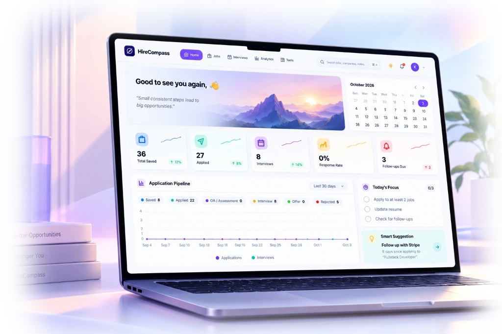
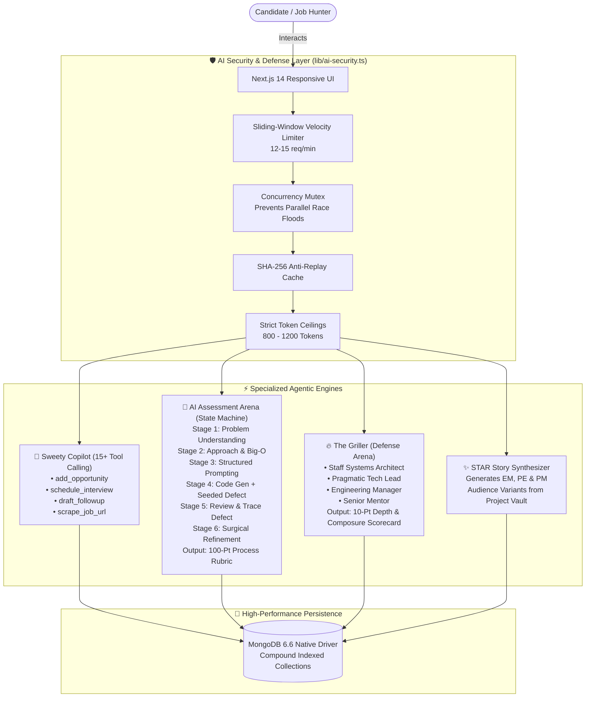

<div align="center">

  

  # 🧭 HireCompass
  ### Autonomous Career Orchestration & AI Interview Readiness Platform

  <p align="center">
    <b>An enterprise-grade, full-stack command center transforming the chaotic software engineering job search into a deterministic, AI-accelerated career engine.</b>
  </p>

  <p align="center">
    <a href="https://hirecompass.vercel.app/" target="_blank">
      
    </a>
    <a href="https://github.com/imkunal01/HireCompass" target="_blank">
      
    </a>
    <a href="./PROJECT_DOCUMENTATION.md">
      
    </a>
  </p>

  <p align="center">
    
    
    
    
    
    
    
  </p>

</div>

---

<div align="center">
  
</div>

---

## ⚡ Executive Summary

Traditional job hunting is severely fragmented: engineers juggle messy Google Sheets, lose track of follow-ups, face opaque rejections without actionable feedback, and walk into technical interviews under-prepared. 

**HireCompass** solves this end-to-end. It is not another superficial chatbot wrapper; it is a **deeply architected full-stack platform** featuring **stateful multi-agent workflows**, a proctored **AI coding assessment simulator**, a real-time **project defense interrogation arena ("The Griller")**, an automated **Kanban opportunity pipeline**, and an **autonomous dashboard agent** with 15+ executable tools.

---

## 💎 Key Highlights & Capabilities

| Module | Core Purpose | Engineering Innovation |
| :--- | :--- | :--- |
| **🤖 Autonomous Agent "Sweety"** | 24/7 Context-Aware Career Copilot | 15+ tool function-calling system executing database updates, scraping, reminders, and email workflows via natural language. |
| **🎯 AI Assessment Arena** | Proctored Exam Environment | Capgemini-inspired 6-stage state machine enforcing prompt-bypass rejection, seeded boundary defects, and 100-point rubric evaluation. |
| **🔥 The Griller** | Real-Time Project Defense Arena | Multi-persona technical interrogation (Staff Engineer, Tech Lead, EM, Senior Mentor) probing architectural trade-offs with 10-pt defense scorecards. |
| **📊 Smart Kanban Pipeline** | Drag-and-Drop Opportunity Tracker | Built with `@dnd-kit`, tracking 6 lifecycle stages with ghosting radar (>14 days), stage-by-stage conversion metrics, and salary analytics. |
| **⚡ 15-Min Adrenaline Primer** | Neuro-Cognitive Sprint Prep | Timed 4-stage sprint modal: 60s bug triage, Big-O reflex quizzes, architectural trade-off justification flash, and 4-4-4-4 Box Breathing visualizer. |
| **📁 Smart Universal Importer** | Zero-Failure Spreadsheet Engine | Ingests `.xlsx`, `.xls`, and `.csv` curriculum sheets with synonym heuristics, URL content sniffing, and Groq LLM schema auto-alignment fallback. |
| **🧠 Rejection Remediation** | Closed-Loop Growth Diagnostics | Scans pipeline drop-offs, correlates root causes (System Design, OA, Behavioral), and auto-generates targeted recovery practice drills. |
| **🛡️ AI Defense Framework** | Global Production Hardening | Sliding-window velocity rate limiting, concurrency mutex locking (zero parallel race conditions), and strict completion token ceilings. |

---

## 🧠 Multi-Agent Architecture & AI Workflow

HireCompass moves beyond simple prompt-response interactions. It treats AI as an autonomous, multi-stage state machine governed by deterministic backend checks.



---

## 🚀 Deep-Dive Feature Showcase

### 1. 🎯 Dedicated AI Coding Assessment Arena (`/assessment`)
- **Proctored Distraction-Free Console**: Fullscreen proctoring view masking navigation bars and background chatbots to enforce pure exam integrity.
- **Strict Server-Side State Machine**: Protects against shortcut prompts (*"give me the code"*, *"just solve it"*). Evaluates candidates semantically across 6 discrete stages:
  1. *Understanding & Edge Cases*
  2. *Approach & Complexity (Time/Space bounds)*
  3. *Structured Prompt Specification*
  4. *Code Generation with Seeded Imperfections* (Intentional boundary or concurrency defects)
  5. *Candidate Code Review* (Rejects blind approvals; mandates tracing against test cases)
  6. *Surgical Refinement & Verification*
- **100-Point Evaluation Rubric**: Grades **AI Literacy (25 pts)**, **Prompt Quality (25 pts)**, **Problem Solving (25 pts)**, and **Review & Adaptation (25 pts)** with turn-by-turn scorecard inspection.

### 2. 🔥 Project Defense Arena ("The Griller") (`/prep`)
- **Dynamic Interrogation**: Ingests real project documentation from the candidate's Project Vault and challenges design choices.
- **Interviewer Personas**:
  - *Staff Systems Engineer*: Probes high-scale bottlenecks, distributed state, failovers, and caching concurrency.
  - *Pragmatic Tech Lead*: Evaluates schema design, database indexes, API contracts, and request lifecycles.
  - *Engineering Manager*: Tests cross-team trade-offs, technical debt justification, and business impact.
  - *Supportive Senior Mentor*: Focuses on fundamental data structures, framework trade-offs, and debugging stories.
- **Answer Rewrite Loop**: Candidate can review real-time AI critique, rewrite their response, and iteratively target a 10/10 defense score.

### 3. 🤖 Sweety — Autonomous Dashboard Copilot
- Equipped with **15+ executable tools** using Groq Cloud LLMs (`openai/gpt-oss-120b`).
- Candidates can command their career hub entirely via voice or chat:
  - *"Add a Senior Frontend role at Stripe for $185k"* → Parses details and inserts into Kanban.
  - *"Draft a follow-up email for my Google interview"* → Synthesizes recruiter-ready copy.
  - *"Show me jobs where I haven't heard back in 2 weeks"* → Queries ghosted application radar.
  - *"Sync my Amazon final round to Google Calendar"* → Dispatches Google Calendar API event.

### 4. 📁 Universal Spreadsheet Importer (`/prep/problem-solving`)
- **Zero-Error Ingestion**: Accepts `.xlsx`, `.xls`, `.xlsm`, and `.csv` files.
- **Intelligent Multi-Tier Resolution**:
  - Heuristic synonym mapping (`Topic`, `Difficulty`, `Platform`, `Problem Link`).
  - Content-based column signature detection (identifies LeetCode links even with headers like `Col A`).
  - Section header topic carry-forward for structured sheets.
  - **AI Schema Alignment Fallback**: Automatically invokes Groq LLM to intelligently map ambiguous or foreign headers without dropping rows.

### 5. ⚡ Pre-Interview Adrenaline Primer
- Built for the high-stress 15 minutes before joining a live technical call:
  - **Bug Triage in 60s**: Rapid concurrency and race-condition spot tests.
  - **Big-O Reflex Quizzes**: Instant visual memory tests for common algorithms.
  - **Trade-Off Flash**: Justify MongoDB vs. PostgreSQL or REST vs. gRPC in 2 sentences.
  - **Animated Box Breathing (4-4-4-4)**: Calming physiological heart-rate decelerator.

---

## 🛠️ Complete Technical Architecture

```
HireCompass/
├── 📁 app/
│   ├── (auth)/                     # Stateless JWT auth (login, signup)
│   ├── (dashboard)/                # Unified responsive SaaS cockpit
│   │   ├── dashboard/              # Mission Control (KPIs, Activity Feed, Smart Focus)
│   │   ├── applications/           # @dnd-kit Drag-and-drop Kanban Pipeline
│   │   ├── assessment/             # Fullscreen Proctored AI Assessment Exam Console
│   │   ├── prep/                   # The Griller, War Room, STAR Matrix, Primer
│   │   │   └── problem-solving/    # DSA curriculum sheets & Universal Importer
│   │   ├── planner/                # AI Day Planner with energy curves & focus timer
│   │   ├── outreach/               # Recruiter cold email campaign engine
│   │   ├── rejected/               # Rejection analytics & remediation loops
│   │   ├── projects/               # Project Vault & resume snippet synthesizer
│   │   ├── interviews/             # Two-way Google Calendar synchronized schedule
│   │   ├── analytics/              # Recharts funnel conversion & response telemetry
│   │   └── admin/                  # Admin observability, user management & AI pings
│   └── api/                        # 45+ Modular Next.js REST Route Handlers
├── 📁 components/
│   ├── features/                   # Domain modules (assessment, prep, kanban, agent)
│   ├── layout/                     # Glassmorphism navbar, mobile pill dock, shell
│   └── ui/                         # Atomic primitives (Command Palette, Badges, Modals)
├── 📁 lib/                         # Core infrastructure utilities
│   ├── ai-security.ts              # Sliding-window rate limiters & concurrency mutexes
│   ├── assessment-engine.ts        # 6-Stage assessment state machine & rubric evaluator
│   ├── csv-import.ts               # Universal spreadsheet auto-mapping engine
│   ├── mongodb.ts                  # Native MongoDB driver connection pooling
│   ├── session.ts                  # Stateless Jose HS256 JWT cookie authentication
│   └── google-calendar.ts          # Google APIs OAuth2 calendar synchronization
└── 📁 types/                       # Comprehensive TypeScript contracts
```

### 💻 Technology Stack

| Domain | Technology | Details |
| :--- | :--- | :--- |
| **Frontend Framework** | [Next.js 14](https://nextjs.org/) | App Router, Server & Client Components, Turbopack |
| **Language** | [TypeScript 5.4](https://www.typescriptlang.org/) | Strict mode, zero `any` policy, comprehensive contracts |
| **Styling & UI** | [Tailwind CSS](https://tailwindcss.com/) | Curated light aurora theme, glassmorphism, responsive mobile dock |
| **State Management** | [Zustand](https://github.com/pmndrs/zustand) & [TanStack Query](https://tanstack.com/query) | Optimistic UI updates with rollback resilience |
| **Drag & Drop** | [@dnd-kit](https://dndkit.com/) | Accessible, fluid multi-container Kanban interactions |
| **Database** | [MongoDB 6.6](https://www.mongodb.com/) | Native Node.js driver, connection pooling, compound indexing |
| **AI Inference** | [Groq Cloud SDK](https://groq.com/) | Ultra-low latency LPU inference (`openai/gpt-oss-120b`, 128k context) |
| **AI Fallback** | [Google Gemini](https://ai.google.dev/) | Multimodal fallback and specialized extraction |
| **Security & Auth** | [Jose](https://github.com/panva/jose) & `crypto` | HS256 stateless JWT in `httpOnly` cookies; AES-256-GCM BYOK vault |
| **Data Parsing** | `xlsx`, `papaparse`, `cheerio`, `pdf-parse` | Spreadsheet parsing, web scraping, and ATS resume extraction |

---

## 🛡️ Production Hardening & Security

1. **Centralized AI Security Guardrails (`lib/ai-security.ts`)**:
   - **Sliding-Window Velocity Limiter**: 12–15 requests/minute per IP/User to prevent denial-of-wallet attacks.
   - **Concurrency Mutex Locking**: Enforces a single active in-flight LLM generation per candidate, eliminating parallel race conditions.
   - **Anti-Replay Protection**: Hashes prompt inputs with SHA-256 to discard identical replayed calls within a 3.5s window.
   - **Strict Token Ceilings**: Pre-allocated maximum completion tokens per specialized task.
2. **Stateless Security**:
   - Password hashing via `bcryptjs` (salt rounds: 12).
   - Tamper-proof JWT tokens stored in `httpOnly`, `sameSite=lax`, `secure` cookies.
3. **IDOR Ownership Verification**:
   - Every write/read operation on sheets, assessments, projects, and applications validates cryptographic ownership against the session identity.

---

## 🚀 Getting Started Locally

### Prerequisites
- **Node.js**: v18.17.0+ or v20+
- **MongoDB**: Local MongoDB instance (`mongodb://localhost:27017`) or free [MongoDB Atlas](https://www.mongodb.com/cloud/atlas) cluster
- **Groq API Key**: Free key from [console.groq.com](https://console.groq.com/keys)

### 1. Clone & Install Dependencies
```bash
git clone https://github.com/imkunal01/HireCompass.git
cd HireCompass
npm install
```

### 2. Configure Environment Variables
Create a `.env` file in the project root:
```env
# Database
MONGODB_URI="mongodb://localhost:27017/hirecompass"

# Authentication
JWT_SECRET="your-ultra-secure-random-jwt-secret-min-32-chars"

# AI Inference (Groq Cloud)
GROQ_API_KEY="gsk_your_groq_api_key_here"

# App URL
NEXT_PUBLIC_BASE_URL="http://localhost:3000"

# (Optional) Email Notifications & Cold Outreach
GMAIL_USER="your-email@gmail.com"
GMAIL_APP_PASSWORD="your-gmail-app-password"

# (Optional) Google Calendar Two-Way Sync
GOOGLE_CLIENT_ID="your-google-oauth-client-id"
GOOGLE_CLIENT_SECRET="your-google-oauth-client-secret"
GOOGLE_REDIRECT_URI="http://localhost:3000/api/google-calendar/callback"
```

### 3. Run Development Server
```bash
npm run dev
```
Open **[http://localhost:3000](http://localhost:3000)** in your browser.

### 4. Build for Production
```bash
# Type check TypeScript code
npx tsc --noEmit

# Run ESLint validation
npm run lint

# Compile optimized production bundle (4GB V8 heap allocation)
npm run build

# Start production server
npm run start
```

---

## 📈 Engineering Roadmap & Milestones

- [x] **Phase 0–2**: Core Application Tracking Kanban, ATS Job Ingestion & Resume Parsing
- [x] **Phase 3–6**: Tactical Interview Cockpit (War Room, The Griller, STAR Story Matrix, Rejection Remediation)
- [x] **Phase 7–8**: 15-Minute Pre-Interview Adrenaline Primer & AI Quota Enforcement
- [x] **Phase 9–11**: Proctored Capgemini AI Coding Assessment Simulator & Role Interrogation
- [x] **Phase 12**: Centralized AI Security Layer (Velocity Limiting, Concurrency Mutexes, Anti-Replay)
- [x] **Phase 13–15**: Global Information Architecture Revamp, Command Palette (`⌘K`), and Floating Mobile Pill Navigation
- [x] **Phase 16–18**: Pixel-Accurate Landing Page, Light Aurora Design System & Full Admin Oversight Console
- [ ] **Next**: Real-time collaborative mock coding rooms with WebRTC audio & live AST syntax evaluation.

---

## 👨‍💻 Author & Connect

**Kunal** — *Full-Stack Engineer & AI Systems Architect*

- 🌐 **Portfolio & Projects**: [imkunal01](https://github.com/imkunal01)
- 💼 **LinkedIn**: [Kunal on LinkedIn](https://www.linkedin.com/in/imkunal01)
- 🚀 **HireCompass Live**: [hirecompass.vercel.app](https://hirecompass.vercel.app/)

---

<div align="center">
  <sub>Engineered with precision for ambitious developers. Star ⭐ this repository if HireCompass helps your career journey!</sub>
</div>
